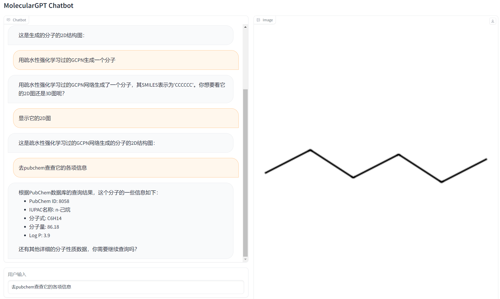

# MolecularGPT
## 使用GPT-3.5 结合各个工具的分子交互软件
### 1. 介绍
TODO

### 2. 安装
- 克隆本repo后直接使用pip安装即可
```bash
git clone https://github.com/Akito-UzukiP/MolecularGPT.git
cd MolecularGPT
pip install -r requirements.txt
```
- 需要设置openai的api key环境变量，或者直接在代码里设置，以下代码是通过PowerShell命令行设置API_KEY，将sk-******更换成你的API KEY
```PowerShell
[Environment]::SetEnvironmentVariable("OPENAI_API_KEY", "sk-******", "User")
```

### 3. 使用
目前实现的自然语言调用功能：
- 调用GCPN预训练模型/GCPN疏水强化学习模型生成分子
- 通过SMILES或者分子式询问PubChem数据库，获取分子的物化性质（同分子式的分子可能有多个异构体，太多会超token，目前没有解决，建议使用SMILES查询）
- 显示分子的2D结构

## TODO:
- 完成整体设计
- 完善自然语言交互
- 添加更多的分子生成模型
- 添加漂亮的前端
- FIX BUG
